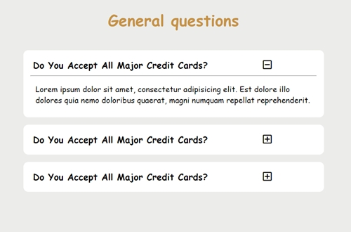

# Questions
This repository contains code for a simple Questions and Answers website. It allows users to expand and collapse questions to view their respective answers.

## Technologies Used

     
     
     
       

 

## Preview

## How to Use
Clone the repository to your local machine.
Open the index.html file in a web browser.
The questions will be displayed on the page.
Click on the question title to expand or collapse the answer.

## Credits
This project is based on the JavaScript Tutorial and Projects Course by John Smilga.
